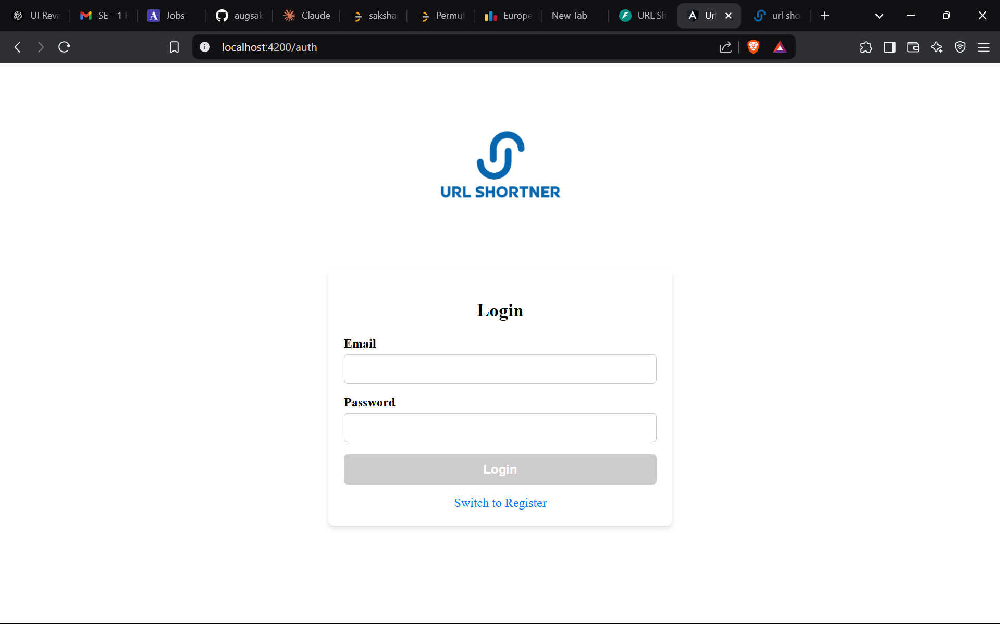
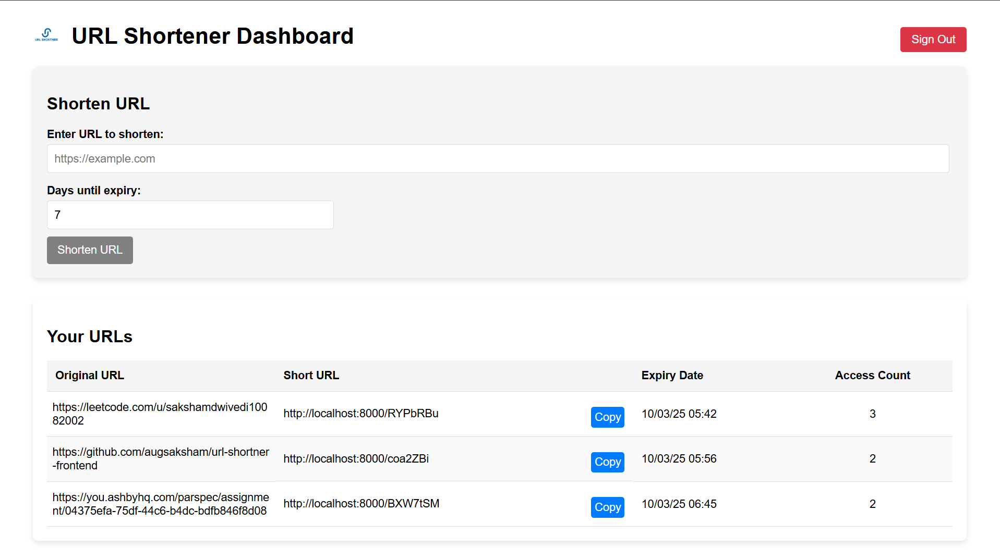
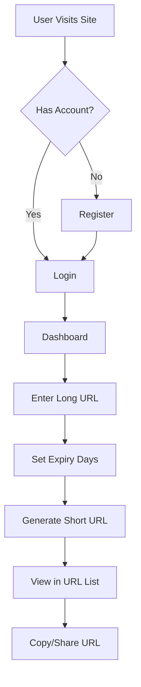
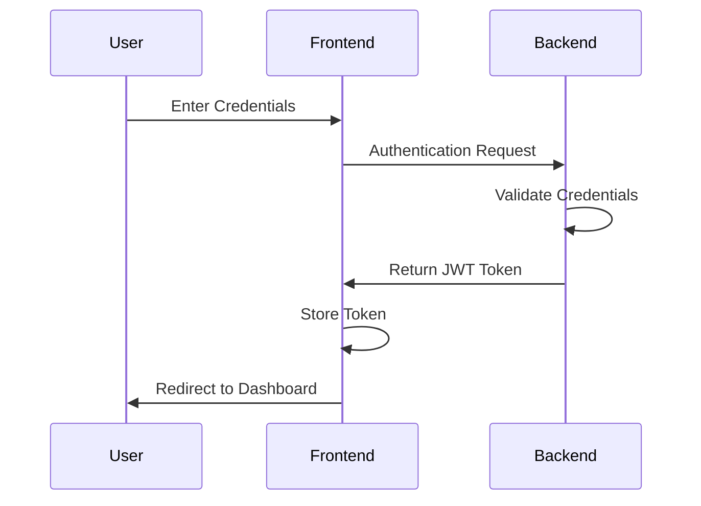
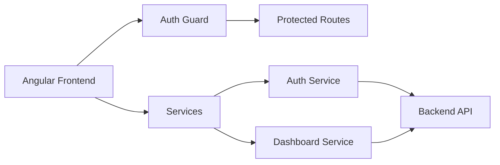

# URL Shortener Frontend

A modern web application built with Angular that provides URL shortening services with user authentication and management capabilities.

## Features

- User authentication (Login/Register)
- URL shortening with custom expiry dates
- Dashboard to manage shortened URLs
- Copy-to-clipboard functionality
- URL access statistics
- Automatic URL validation
- Responsive design

## Auth Page:


## Dashboard Page: 


## User Journey



## Authentication Flow



## System Architecture



## Setup and Installation

1. Clone the repository
```bash
git clone https://github.com/augsaksham/url-shortner-frontend
cd url-shortner-frontend
```

2. Install dependencies
```bash
npm install
```

3. Start the development server
```bash
ng serve
```

4. Navigate to `http://localhost:4200`

## Project Structure

```
url-shortner-frontend/
├── src/
│   ├── app/
│   │   ├── components/
│   │   │   ├── auth/
│   │   │   └── dashboard/
│   │   ├── services/
│   │   ├── guards/
│   │   └── app.module.ts
│   ├── assets/
│   └── environments/
└── package.json
```
